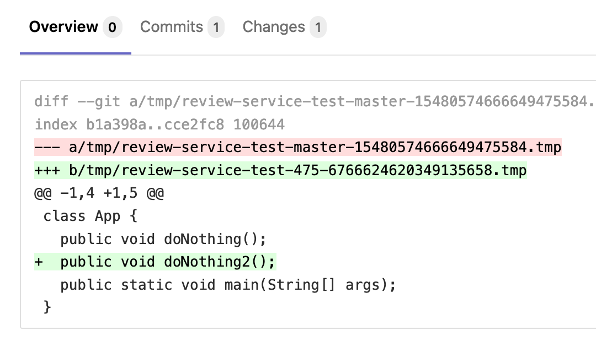
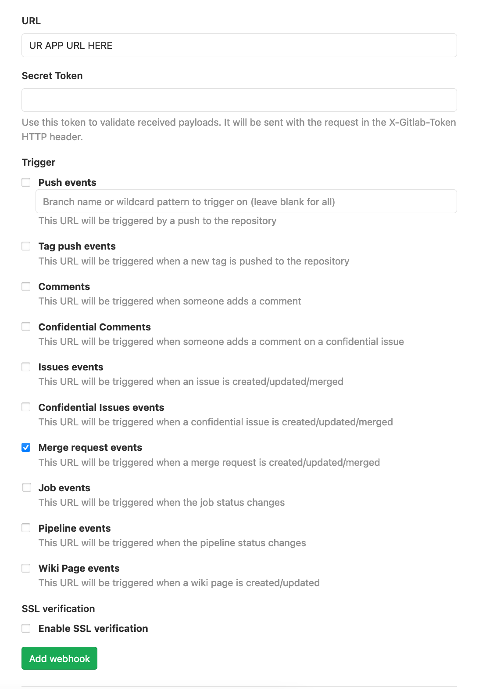

## Review service

The service supports Java and adds architectural changes diff to the merge request description.

### Usage

You will see something similar in new merge requests description:

### Deploy example for [`Digital Ocean`](https://cloud.digitalocean.com/)

1. Create new user in your GitLab.
1. Go to `avatar`, `settings`, `Access Tokens` and create new access token for him.
1. Create new Digital Ocean app [`here`](https://cloud.digitalocean.com/apps) and specify this
   repository (or fork).
1. In your Digital Ocean app, go to `components`, `Environment Variables` and customize webhook
   via `GITLAB_URL` (your gitlab host url) and `GITLAB_TOKEN` (see step 2) environment variables.
1. In your Gitlab project, go to `settings`, `webhooks`, then, check the boxes like in the picture
   and click the green button:
   
1. Add user-bot to your project as developer.

